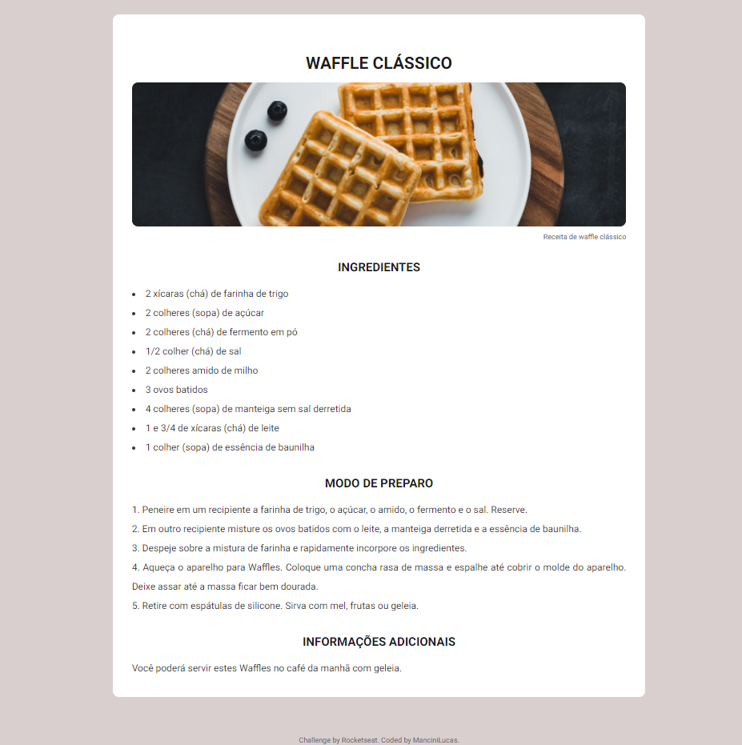

# discover-desafio-receita

Solution developed through Rocketseat's Discover platform proposal. [Discover - Página de receita](https://app.rocketseat.com.br/discover/challenges/cookbook).

## Table of contents

- [Overview](#overview)
  - [The challenge](#the-challenge)
  - [Screenshot](#screenshot)
- [My process](#my-process)
- [Built with](#built-with)
- [What I learned](#what-i-learned)

## Overview

### The challenge

In this challenge I would need to create a recipe webpage with title, image, ingredients list and preparation mode.

### Screenshot

### Links

- Solution URL: [Recipe webpage](https://github.com/mancinilucas)

## My process

### Built with

- Semantic HTML5 markup
- CSS custom properties

### What I learned

Review of studied content such as:

- Semantic HTML5
- Flexbox
- Desktop responsive design
